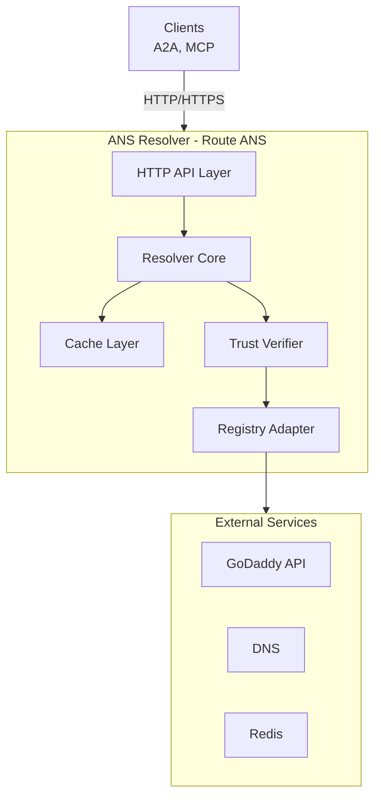
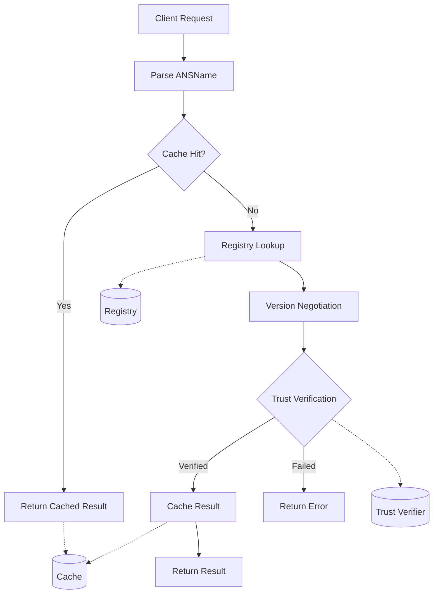
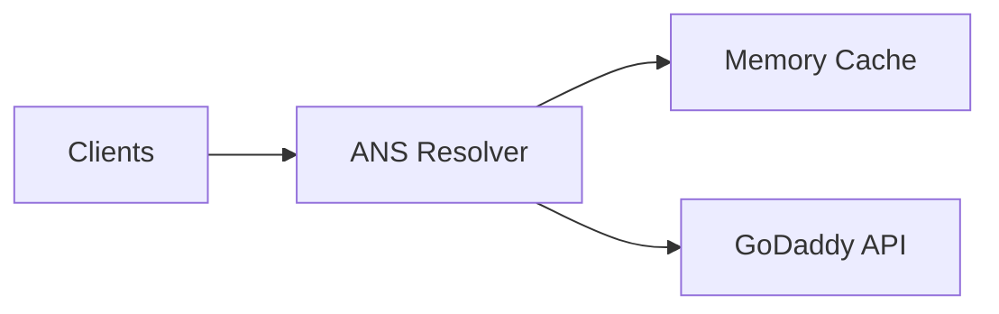
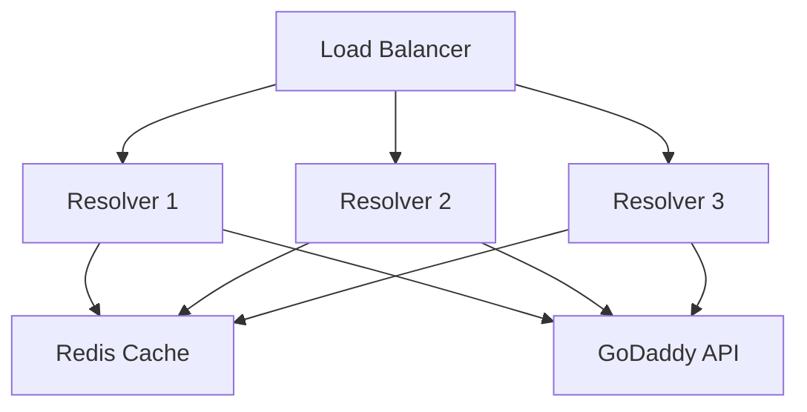
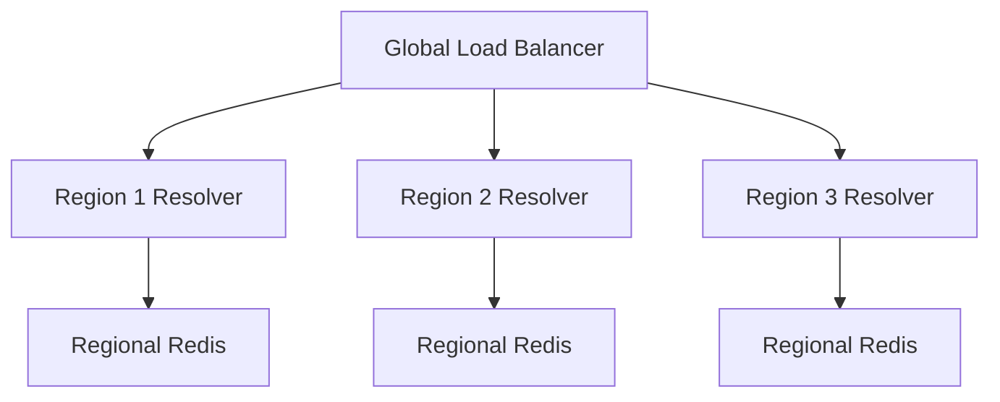

# Architecture Overview

Route ANS Resolver system architecture and design principles.

## System Architecture

## Core Components

### 1. HTTP API Layer
**Location**: `internal/server/`

Handles HTTP requests and responses:

- REST API endpoints for resolution, batch operations, and health checks
- Request validation and response formatting
- Rate limiting to prevent abuse
- Middleware chain for cross-cutting concerns
- Prometheus metrics exposure

**Design Pattern**: Middleware Chain pattern allows composable request processing (logging, rate limiting, authentication, etc.).

### 2. Resolver Core
**Location**: `internal/resolver/`

Core resolution logic:

- ANSName parsing and validation
- Version negotiation using semantic versioning
- Agent selection from multiple candidates
- Resolution orchestration coordinating cache, registry, and trust verification

**Design Pattern**: Facade pattern that provides a simple interface to the complex subsystem of caching, registry lookup, version negotiation, and trust verification.

### 3. Cache Layer
**Location**: `internal/cache/`

Resolution result caching:

- Memory-based cache for single-instance deployments
- Redis-based cache for distributed deployments
- TTL management with configurable expiration
- Cache invalidation strategies

**Design Pattern**: Strategy pattern allows switching between memory and Redis implementations based on deployment requirements.

**Extensibility**: New cache backends (Memcached, DynamoDB) can be added by implementing the cache interface without modifying core logic.

### 4. Trust Verifier
**Location**: `internal/trust/`

Certificate verification:

- Fingerprint validation against published certificates
- Certificate chain validation
- Trust store management for allowed CAs
- Revocation checking (OCSP, CRL)

**Design Pattern**: Chain of Responsibility for multi-stage verification (fingerprint → chain → revocation).

**Design Trade-off**: Strict verification by default prevents MITM attacks but requires proper certificate management. Permissive mode available for development.

### 5. Registry Adapter
**Location**: `internal/registry/`

Backend registry integration:

- GoDaddy API client for managed DNS
- DNS TXT record lookup for self-hosted registries
- Mock registry for testing environments
- Extensible adapter interface

**Design Pattern**: Adapter pattern allows multiple registry backends (GoDaddy, DNS, custom APIs) behind a uniform interface.

**Extensibility**: New registries (Namecheap, Cloudflare, Route53) can be added without changing resolver logic.

## Design Principles

### 1. Stateless Operation

The resolver maintains no session state, enabling:

- Horizontal scaling with load balancers
- Zero-downtime deployments
- Simple disaster recovery (just restart)
- No complex state synchronization

**Trade-off**: Cache is the only state, managed separately (Redis for distributed, memory for single-instance).

### 2. Fail-Fast

Requests fail quickly rather than hanging:

- Short timeouts on external calls (registry, trust verification)
- Explicit error returns for all failure modes
- Circuit breakers prevent cascading failures
- Health checks detect degraded state

**Benefit**: Clients get quick feedback and can retry or failover immediately.

### 3. Extensibility

Plugin architecture via interfaces:

- **Registry adapters**: Add new registry backends
- **Cache providers**: Add new cache implementations
- **Trust verifiers**: Add custom verification logic
- **Middleware**: Add custom request processing

**Pattern**: Dependency injection allows runtime composition of components.

### 4. Observable

Built-in observability:

- **Metrics**: Prometheus metrics for all operations (requests, cache hits, registry latency)
- **Logging**: Structured JSON logs with trace IDs
- **Tracing**: OpenTelemetry support for distributed tracing
- **Health checks**: Liveness and readiness probes

**Design Choice**: Zero-config defaults with optional exporters keeps it simple while enabling production observability.

## Configuration Hierarchy

Configuration sources in priority order:

1. **Command-line flags**: Override everything (e.g., `--port=8080`)
2. **Environment variables**: Per-environment config (e.g., `SERVER_PORT=8080`)
3. **Configuration file**: Base configuration (YAML)
4. **Defaults**: Sensible defaults for quick starts

**Design Rationale**: 12-factor app principles for cloud-native deployments.

## Resolution Flow

**Flow Characteristics:**

- **Optimistic caching**: Cache checked first, misses go to registry
- **Version negotiation**: Selects best matching version from available agents
- **Trust verification**: Optional but recommended for security
- **Cache-aside pattern**: Application manages cache explicitly

## Deployment Patterns

### Single Instance

- **Use Case**: Development, testing, small-scale production
- **Characteristics**: Simple, no dependencies, fast startup
- **Limitation**: No horizontal scaling, cache not shared

### Distributed

- **Use Case**: High-availability production
- **Characteristics**: Horizontal scaling, shared cache, zero-downtime updates
- **Requirement**: Redis for shared cache state

### Edge Deployment

- **Use Case**: Global, latency-sensitive applications
- **Characteristics**: Regional deployments, CDN-like caching, 99.99% availability
- **Trade-off**: Regional caches may have different TTLs, eventual consistency

## API Design

### HTTP Endpoints

| Method | Path | Purpose |
|--------|------|---------|
| GET | `/v1/resolve` | Resolve single ANS name |
| POST | `/v1/resolve/batch` | Resolve multiple ANS names in one request |
| GET | `/v1/agent/{ansName}` | Get agent metadata without full resolution |
| GET | `/v1/agent/{ansName}/verify` | Verify agent certificate independently |
| GET | `/health` | Liveness probe (is process running?) |
| GET | `/ready` | Readiness probe (can it serve traffic?) |
| GET | `/metrics` | Prometheus metrics |

**Design Choice**: RESTful with clear separation between resolution (GET /resolve) and batch operations (POST /resolve/batch).

### Versioned API

API version in URL path (`/v1/...`):

- **Stability**: v1 API is stable and backward-compatible
- **Evolution**: v2 can be added alongside v1 without breaking existing clients
- **Deprecation**: Old versions deprecated with long notice period

## Error Handling

Error response structure:

- **HTTP status codes**: Standard semantics (404 = not found, 500 = server error)
- **Error details**: Structured error info (code, message, request_id)
- **Idempotency**: Safe to retry GET requests
- **Partial failure**: Batch operations return partial results with per-item errors

**Failure Modes:**

- **ANS name not found**: 404 with error code
- **Invalid ANS name**: 400 with validation details
- **Registry timeout**: 504 with retry-after header
- **Trust verification failed**: 403 with certificate details
- **Rate limit exceeded**: 429 with retry-after header

## Performance Characteristics

**Latency Targets:**

- Cache hit: < 5ms (p99)
- Cache miss: < 100ms (p95) including registry lookup
- Batch operations: < 200ms for 10 names (p95)

**Throughput:**

- Single instance: 1000+ req/s with hot cache
- Distributed: Limited by registry backend, not resolver

**Scaling:**

- **Horizontal**: Add more resolver instances behind load balancer
- **Cache**: Redis supports 100k+ ops/s
- **Bottleneck**: External registry API rate limits

## Security Model

Security boundaries:

1. **Resolver → Client**: TLS/HTTPS via reverse proxy (nginx, Traefik)
2. **Resolver → Registry**: HTTPS with API authentication
3. **Client → Agent**: Agent handles its own TLS and authentication

**Trust Model:**

- Resolver validates agent certificates (fingerprints)
- Resolver does NOT authenticate clients (optional via reverse proxy)
- Agent endpoints handle their own authentication

**Rationale**: Resolver is a discovery service (like DNS), security happens at the endpoints being discovered.

## Extensibility Points

### 1. Custom Registry Backends

Add new registry sources:

- Database-backed registries (PostgreSQL, MongoDB)
- Blockchain-based registries (ENS-style)
- Cloud service directories (AWS Service Discovery, Consul)

**Extension Pattern**: Implement registry adapter interface with lookup methods.

### 2. Custom Cache Providers

Add new cache backends:

- Memcached for specific use cases
- DynamoDB for serverless deployments
- Local disk cache for edge scenarios

**Extension Pattern**: Implement cache interface with get/set/delete methods.

### 3. Custom Trust Verification

Add domain-specific verification:

- Organization-specific CA requirements
- Certificate transparency log checks
- Custom revocation mechanisms

**Extension Pattern**: Implement trust verifier interface with verification logic.

### 4. Custom Middleware

Add request processing:

- Custom authentication (OAuth, mTLS)
- Request transformation
- Response filtering
- Custom metrics/logging

**Extension Pattern**: Standard HTTP middleware signature, compose via chain.

## Next Steps

- **[Component Details](components.md)** - Deep dive into each component
- **[Resolution Flow](resolution-flow.md)** - Detailed resolution process
- **[ANS Specification](ans-spec.md)** - ANS name format and protocol
