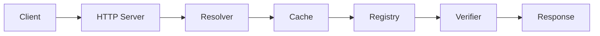
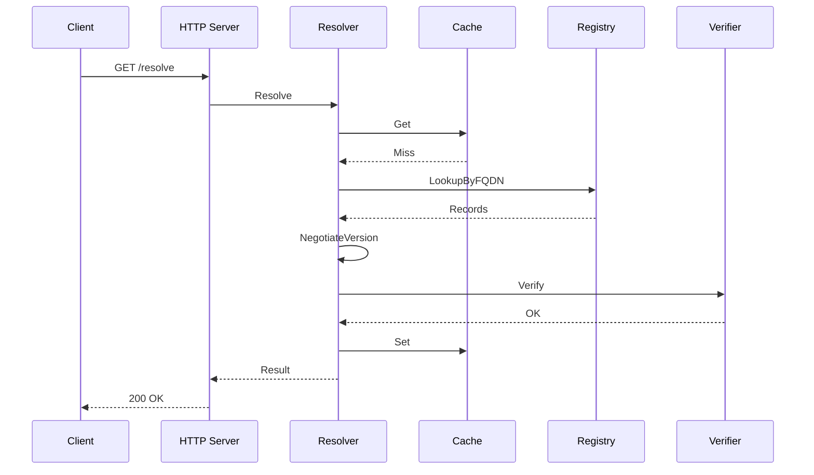
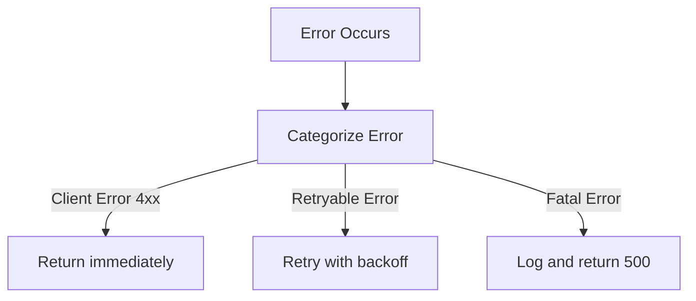

# Resolution Flow

Complete request lifecycle and internal processing flow.

## Overview

## Detailed Flow

### 1. Client Request

Client submits resolution request with:

- ANSName (required)
- Version range (optional, defaults to exact match)
- Query parameters for filtering and preferences

**HTTP Method**: GET for single resolution, POST for batch operations

### 2. HTTP Handler (`internal/server/http.go`)

**Request Processing**:

- Extract ANSName and version range from query parameters
- Validate required parameters and format
- Apply authentication and rate limiting middleware
- Record request start time for latency metrics

**Middleware Chain Execution**:

1. Request logging with correlation ID
2. Authentication/authorization checks
3. Rate limit validation
4. Request body parsing and validation

**Design Pattern**: **Chain of Responsibility** - middleware can short-circuit on validation failures.

**Error Handling**: Return HTTP 400 for validation errors with structured problem details.

**Orchestration**: Delegate to resolver core, handle response serialization.

### 3. Resolver Core (`internal/resolver/resolver.go`)

**Resolution Workflow**:

**Step 3.1: ANSName Parsing**

- Parse protocol, capability, PID, version, FQDN from ANSName
- Validate format compliance with ANS specification
- Extract version for comparison operations

**Step 3.2: Cache Lookup**

- Generate cache key from ANSName and version range
- Check cache for existing resolution result
- On cache hit: increment metrics, return cached result
- On cache miss: proceed to registry lookup

**Design Trade-off**: Cache improves performance but may return stale data. TTL aligned with agent record expiration minimizes staleness.

**Step 3.3: Registry Lookup**

- Query registry adapter for agent records by FQDN
- Retrieve all versions for the specified agent
- Handle registry timeouts with retry logic
- Return error if registry unavailable or agent not found

**Step 3.4: Version Negotiation**

- Filter records matching requested version range
- Apply semantic versioning comparison rules
- Select highest matching version (or exact match if no range)
- Return version not found error if no matches

**Design Pattern**: **Strategy Pattern** - version selection algorithm can be customized (latest stable, preferred versions, etc.)

**Step 3.5: Trust Verification**

- Connect to agent endpoint via TLS
- Extract certificate and compute fingerprint
- Compare against fingerprint in agent record
- Optionally validate certificate chain and revocation
- Skip verification if trust mode is disabled

**Design Trade-off**: Verification adds latency (~100-500ms) but ensures authenticity. Configurable per-environment.

**Step 3.6: Result Construction**

- Build resolution result with verified endpoint
- Include protocol extensions and metadata
- Set status based on verification outcome
- Capture expiration time from agent record

**Step 3.7: Cache Storage**

- Calculate TTL from agent record expiration
- Store result in cache with computed TTL
- Handle cache write failures gracefully (log but don't fail request)

### 4. Registry Lookup (`internal/registry/godaddy.go`)

**Registry Interaction**:

**Domain Extraction**:

- Parse FQDN to identify registrar domain
- Handle subdomains and multi-level domains

**API Request Construction**:

- Build REST API request for TXT record lookup
- Include authentication headers (API key/secret)
- Set timeout for request (configurable, default 10s)
- Add retry policy for transient failures

**Response Processing**:

- Parse JSON response from registry API
- Extract TXT record data from DNS records
- Decode JSON-encoded agent records
- Filter out malformed or invalid records

**Error Handling**:

- Distinguish between "not found" and "service unavailable"
- Return appropriate error types for retry logic
- Log registry errors for debugging

**Design Pattern**: **Adapter Pattern** - translates GoDaddy API to internal registry interface.

**Connection Pooling**: Reuse HTTP connections for performance.

### 5. Version Negotiation (`pkg/ansname/version.go`)

**Version Selection Algorithm**:

**Range Parsing**:

- Parse version range syntax (caret, tilde, operators, wildcards)
- Construct matching criteria from range specification
- Handle special cases (any version, latest, exact)

**Candidate Filtering**:

- Iterate through all agent records from registry
- Parse semantic version from each record
- Apply range matching rules to filter candidates
- Exclude pre-release versions unless explicitly requested

**Version Comparison**:

- Sort matching candidates by semantic version
- Use semantic versioning precedence rules (major.minor.patch)
- Select highest version that satisfies range

**Design Pattern**: **Strategy Pattern** - version selection strategy can be swapped (prefer stable, allow prerelease, etc.)

**Edge Cases**:

- No matching versions: return nil
- Multiple versions match: select highest
- Invalid version format: skip record with warning

### 6. Trust Verification (`internal/trust/verifier.go`)

**Verification Workflow**:

**TLS Connection**:

- Establish TLS connection to agent endpoint
- Configure timeout for connection (default 5s)
- Skip CA verification initially (verify manually via fingerprint)

**Certificate Extraction**:

- Retrieve peer certificates from TLS connection state
- Extract first certificate (leaf certificate)
- Validate certificate chain present

**Fingerprint Calculation**:

- Compute SHA-256 hash of certificate DER encoding
- Convert hash to hex string format
- Normalize fingerprint format (uppercase, colon-separated)

**Comparison**:

- Compare calculated fingerprint with expected value from registry
- Use constant-time comparison to prevent timing attacks
- Return fingerprint mismatch error if not equal

**Optional Chain Validation**:

- If strict mode enabled, validate certificate chain
- Check certificate expiration
- Verify certificate purpose and key usage
- Check revocation status (CRL/OCSP)

**Design Pattern**: **Template Method Pattern** - defines verification steps, allows customization of validation.

**Security Trade-off**: Fingerprint-based trust bypasses CA system but enables decentralized trust model.

### 7. Response

**Response Structure**:

- Status: verification result (verified/unverified/expired/revoked)
- Agent: resolved ANSName with selected version
- Protocol: communication protocol (mcp, a2a, etc.)
- Endpoint: HTTPS URL for connecting to agent
- Certificate Fingerprint: SHA-256 hash for verification
- Expiration: timestamp when record expires
- Protocol Extensions: custom metadata for protocol-specific features

**HTTP Response**:

- Status Code: 200 OK for successful resolution
- Content-Type: application/json
- Cache headers based on TTL

**Design Pattern**: **Data Transfer Object (DTO)** - structured response for client consumption.

## Sequence Diagram

## Batch Resolution

**Parallel Processing**:

- Accept multiple ANSNames in single request
- Spawn goroutine for each resolution
- Process resolutions concurrently for performance
- Use sync primitives (WaitGroup, Mutex) for coordination

**Result Aggregation**:

- Collect results as resolutions complete
- Map ANSName to result or error
- Return partial results on timeout

**Design Pattern**: **Fork-Join Pattern** - spawn parallel tasks, wait for completion, aggregate results.

**Performance Optimization**: Bounded concurrency to prevent resource exhaustion.

**Error Handling**: Individual resolution errors don't fail entire batch.

## Error Handling Flow

## Performance Optimizations

1. **Cache First**: Check cache before expensive registry operations
    - Reduces latency from ~500ms to <10ms for cache hits
    - Decreases load on registry backend

2. **Connection Pooling**: Reuse HTTP connections to registry and agents
    - Eliminates TLS handshake overhead
    - Reduces connection establishment time

3. **Parallel Batch**: Process batch requests concurrently
    - Linear scaling for batch operations
    - Bounded worker pools prevent resource exhaustion

4. **Lazy Verification**: Make trust verification optional
    - Reduce latency by ~100-500ms when disabled
    - Trade-off between security and performance

5. **Result Streaming**: Stream large batch responses
    - Reduce memory footprint for large batches
    - Enable progressive processing on client side

**Design Philosophy**: Performance optimizations are configurable to match deployment requirements.

## Next Steps

- **[ANS Spec](ans-spec.md)** - ANS specification
- **[Components](components.md)** - Component details
- **[Extending](../development/extending.md)** - Custom implementations
