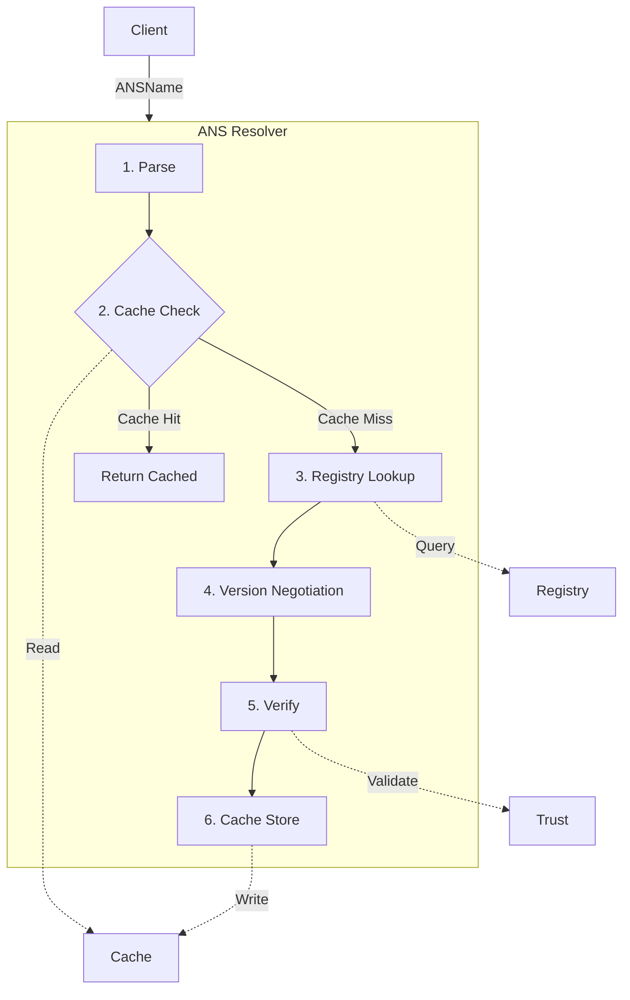
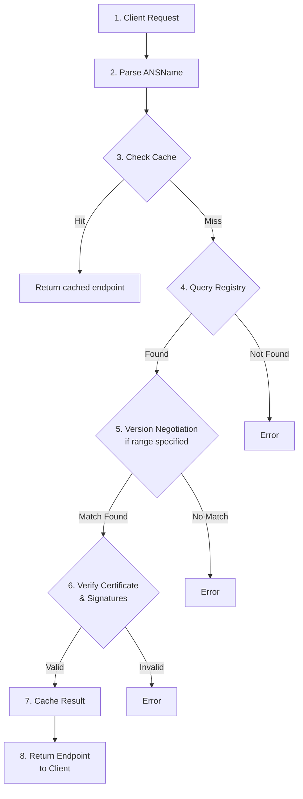

# Basic Concepts

Understanding ANS and the Resolution Server.

## What is ANS?

**Agent Name System (ANS)** is a naming and resolution protocol for autonomous AI agents. Think of it as "DNS for AI agents" - it translates agent names into verified endpoints.

### Key Differences from DNS

| Feature | DNS | ANS |
|---------|-----|-----|
| **Purpose** | Resolve domain names to IPs | Resolve agent names to verified endpoints |
| **Security** | Optional (DNSSEC) | Mandatory (PKI + Merkle proofs) |
| **Versioning** | No versioning | Semantic versioning built-in |
| **Capabilities** | No metadata | Protocol-specific capabilities |
| **Discovery** | Limited (SRV records) | Rich capability-based discovery |

## Core Concepts

### ANSName

An **ANSName** is the canonical identifier for an agent:

```
protocol://agentName.capability.providerID.version.extension
```

**Example:**
```
mcp://chatbot.conversation.PID-5678.v1.2.3.example.com
```

**Components:**
- **protocol**: Communication protocol (mcp, a2a, acp, https)
- **agentName**: Unique name assigned by provider
- **capability**: High-level function (e.g., conversation, analysis)
- **providerID**: Non-semantic provider identifier (e.g., PID-5678)
- **version**: Semantic version (v1.2.3)
- **extension**: Trust anchor domain (e.g., example.com)

### Resolution

**Resolution** is the process of converting an ANSName to a verified endpoint:

```
ANSName → Registry Lookup → Verification → Endpoint
```

1. **Parse** the ANSName
2. **Query** the registry
3. **Negotiate** version (if range specified)
4. **Verify** cryptographic signatures
5. **Return** verified endpoint

### Registry

A **Registry** is the authoritative source for agent registrations. It stores:

- Agent metadata (name, capability, endpoint)
- PKI certificates
- Merkle proofs for verification
- Protocol-specific extensions

Registries are analogous to DNS nameservers but with cryptographic guarantees.

### Verification

**Verification** ensures trust through:

1. **Digital Signatures**: Signed by provider's private key
2. **Certificate Validation**: Valid PKI certificate chain
3. **Merkle Proofs**: Inclusion in registry's Merkle tree
4. **Revocation Checks**: Certificate not revoked

### Caching

**Caching** improves performance by storing resolved endpoints:

- **Cache Hit**: Instant response (<10ms)
- **Cache Miss**: Registry lookup + verification (~100ms)
- **TTL**: Time-to-live for cache entries (configurable)

### Version Negotiation

**Version Negotiation** selects the best version from available options:

```bash
# Request: Any 1.x version
GET /v1/resolve?name=mcp://agent.PID-123.v1.0.0.example.com&version=1.x

# Available: v1.0.0, v1.1.0, v1.2.0, v2.0.0
# Selected: v1.2.0 (highest 1.x)
```

Supports semantic version ranges:
- `^1.0.0` - Compatible with 1.0.0
- `~1.2.3` - Patch updates only
- `1.x` - Any minor/patch in version 1
- `*` - Latest version

## Architecture Overview



## Protocols

ANS supports multiple agent communication protocols:

### A2A (Agent-to-Agent)
- Direct agent communication
- Peer-to-peer architecture
- Example: `a2a://agent.capability.PID-123.v1.0.0.example.com`

### MCP (Model Context Protocol)
- Anthropic's protocol for AI models
- Context-aware interactions
- Example: `mcp://model.context.PID-456.v2.0.0.example.com`

### ACP (Agent Communication Protocol)
- Generic agent communication
- Protocol-agnostic
- Example: `acp://agent.service.PID-789.v1.5.0.example.com`

### HTTPS
- Standard HTTP/HTTPS endpoints
- Web-accessible agents
- Example: `https://api.example.com.PID-999.v1.0.0.example.com`

## Security Model

### Trust Anchor

The **Extension** (e.g., example.com) serves as the trust anchor for **agent endpoints**:
- Provider owns the domain
- Agent endpoint has a certificate issued for the domain
- Chain of trust to root CA

!!! note "Resolver TLS"
    The resolver itself does not handle TLS. Deploy behind a reverse proxy (nginx, Traefik, etc.) or load balancer for TLS termination.

### Cryptographic Verification

The resolver **verifies agent endpoints** during resolution:

1. **Signature Verification**: Proves agent authenticity
2. **Certificate Validation**: Validates agent endpoint certificate
3. **Merkle Proof**: Proves registry inclusion (if supported)
4. **Revocation Check**: Ensures agent certificate not revoked

### Verification Modes

- **Strict**: All checks must pass (recommended for production)
- **Permissive**: Log failures but continue (development)
- **Disabled**: Skip verification (testing only)

## Use Cases

### 1. Service Discovery
```
Find all agents with "translation" capability
```

### 2. Version Management
```
Request latest compatible version of an agent
```

### 3. Trust Verification
```
Ensure agent is authorized and not compromised
```

### 4. Protocol Negotiation
```
Discover agent's supported protocols and features
```

### 5. High Availability
```
Failover to alternative endpoints automatically
```

## Terminology

| Term | Definition |
|------|------------|
| **ANSName** | Canonical agent identifier |
| **Resolver** | Service that performs resolution |
| **Registry** | Authoritative source of agent records |
| **Endpoint** | URL/address where agent is accessible |
| **Provider** | Organization that operates the agent |
| **Capability** | High-level function the agent performs |
| **FQDN** | Fully Qualified Domain Name (without protocol) |
| **TTL** | Time-To-Live for cache entries |
| **SemVer** | Semantic Versioning (MAJOR.MINOR.PATCH) |

## Resolution Lifecycle



## Next Steps

- **[Tutorial](tutorial.md)** - Hands-on walkthrough
- **[Version Negotiation](reference/version-negotiation.md)** - Deep dive into versioning
- **[Architecture](architecture/overview.md)** - Detailed system design
