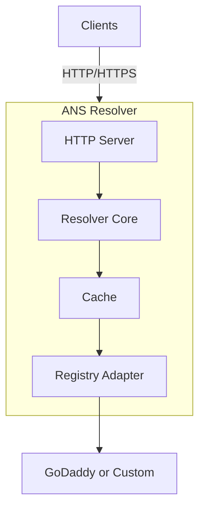

# Welcome to Route ANS

**Route ANS** is a high-performance Agent Name System (ANS) resolver that enables secure, decentralized discovery of AI agents through semantic versioning and certificate verification.

## What is ANS?

The Agent Name System (ANS) provides a standardized naming and discovery mechanism for AI agents, similar to how DNS works for websites. ANS enables:

- 🔍 **Agent Discovery** - Find agents by capability and protocol
- 📦 **Version Negotiation** - Request compatible agent versions using semantic versioning
- 🔒 **Trust Verification** - Verify agent authenticity through certificate fingerprints
- 🌐 **Protocol Support** - MCP, A2A, ACP, HTTPS protocols
- ⚡ **High Performance** - Sub-millisecond resolution with caching

## Quick Example

```bash
# Resolve an agent
curl "http://localhost:8080/v1/resolve?name=mcp://chatbot.conversation.PID-5678.v1.2.3.example.com"

# Get latest compatible version
curl "http://localhost:8080/v1/resolve?name=mcp://chatbot.conversation.PID-5678.v1.0.0.example.com&version=^1.0.0"

# Response
{
  "status": "verified",
  "agent": "mcp://chatbot.conversation.PID-5678.v1.2.3.example.com",
  "protocol": "mcp",
  "endpoint": "https://agent.example.com:8443",
  "certFingerprint": "SHA256:abc123...",
  "expiresAt": "2025-01-15T00:00:00Z"
}
```

## Key Features

### 🚀 Performance
- **Sub-millisecond response** with memory/Redis caching
- **Concurrent resolution** for batch requests
- **Connection pooling** to registries
- **Horizontal scaling** support

### 🔐 Security
- **Certificate verification** via SHA-256 fingerprints
- **TLS/mTLS support** for secure communication
- **Trust store validation** for strict mode
- **Rate limiting** to prevent abuse

### 📊 Semantic Versioning
- **Caret ranges** (`^1.2.3`) - Compatible updates
- **Tilde ranges** (`~1.2.3`) - Patch-level updates
- **Wildcards** (`1.x`, `1.2.x`) - Flexible matching
- **Operators** (`>=1.0.0`, `<2.0.0`) - Precise control

### 🔌 Extensible
- **Pluggable registries** - GoDaddy, custom backends
- **Cache providers** - Memory, Redis, custom
- **Multiple protocols** - MCP, A2A, ACP, HTTPS
- **Custom extensions** - Protocol-specific metadata

## Getting Started

### Installation

```bash
# Download binary
wget https://github.com/route-ans/route-ans/releases/latest/download/ans-resolver-linux-amd64
chmod +x ans-resolver-linux-amd64

# Or use Docker
docker run -p 8080:8080 ghcr.io/route-ans/route-ans:latest

# Or build from source
git clone https://github.com/route-ans/route-ans
cd route-ans
make build
```

### Basic Configuration

```yaml
# config.yaml
server:
  host: 0.0.0.0
  port: 8080

cache:
  provider: memory
  ttl:
    default: 300s

registries:
  - name: godaddy
    type: godaddy
    config:
      apiKey: "${GODADDY_API_KEY}"
      apiSecret: "${GODADDY_API_SECRET}"

trust:
  provider: file
  verification:
    enabled: true
    mode: permissive
```

### Run the Resolver

```bash
# Start server
./ans-resolver --config config.yaml

# Test resolution
curl http://localhost:8080/health
```

## Documentation

### 📚 For Users
- **[Quick Start Guide](getting-started.md)** - Get running in 5 minutes
- **[Installation](installation.md)** - Complete setup for all platforms
- **[Tutorial](tutorial.md)** - Step-by-step hands-on guide
- **[Examples](examples.md)** - Python, JavaScript, Go code samples

### 🔧 For Operators
- **[Deployment](deployment.md)** - Docker, Kubernetes, cloud
- **[Configuration](configuration.md)** - Complete config reference
- **[Monitoring](monitoring.md)** - Metrics, logging, alerting
- **[Security](security.md)** - TLS, authentication, best practices

### 🏗️ For Developers
- **[Architecture](architecture/overview.md)** - System design
- **[Extending](development/extending.md)** - Custom components
- **[Testing](development/testing.md)** - Test guide

## Use Cases

### Agent Discovery
Find and connect to AI agents by capability:
```bash
# Find translation agent
curl "http://localhost:8080/v1/resolve?name=a2a://translation.text.PID-1234.v2.0.0.agents.org"
```

### Version Negotiation
Request compatible versions automatically:
```bash
# Get any 1.x version (backwards compatible)
curl "http://localhost:8080/v1/resolve?name=mcp://agent.PID-123.v1.0.0.example.com&version=^1.0.0"
```

### Service Mesh
Enable secure agent-to-agent communication:
```yaml
# agents can discover and communicate securely
agent-a → ANS Resolver → agent-b
```

### Multi-Protocol Support
Support different communication protocols:

- **MCP** - Model Context Protocol for AI models
- **A2A** - Agent-to-Agent messaging
- **ACP** - Agent Communication Protocol
- **HTTPS** - Standard REST APIs

## Architecture



## Performance

Typical performance metrics:

- **Cached resolution**: <1ms
- **Uncached resolution**: 50-200ms
- **Throughput**: 10K+ req/s (single instance)
- **Cache hit rate**: >80% typical
- **Memory usage**: ~50MB base

## Community

- **GitHub**: [route-ans/route-ans](https://github.com/route-ans/route-ans)
- **Issues**: [Report bugs or request features](https://github.com/route-ans/route-ans/issues)
- **Discussions**: [Ask questions and share ideas](https://github.com/route-ans/route-ans/discussions)
- **Documentation**: [route-ans.github.io/route-ans](https://route-ans.github.io/route-ans)

## Contributing

We welcome contributions! See [CONTRIBUTING.md](https://github.com/route-ans/route-ans/blob/main/CONTRIBUTING.md) for guidelines.

## License

Route ANS is open-source software. See [LICENSE](https://github.com/route-ans/route-ans/blob/main/LICENSE) for details.

---

## Next Steps

- **New to ANS?** Start with [Basic Concepts](concepts.md)
- **Ready to install?** Follow the [Installation Guide](installation.md)
- **Want to try it?** Check out the [Tutorial](tutorial.md)
- **Need examples?** Browse [Code Examples](examples.md)
- **Deploying to production?** Read [Deployment Guide](deployment.md)
